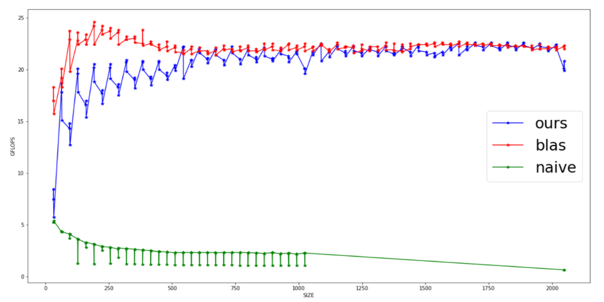
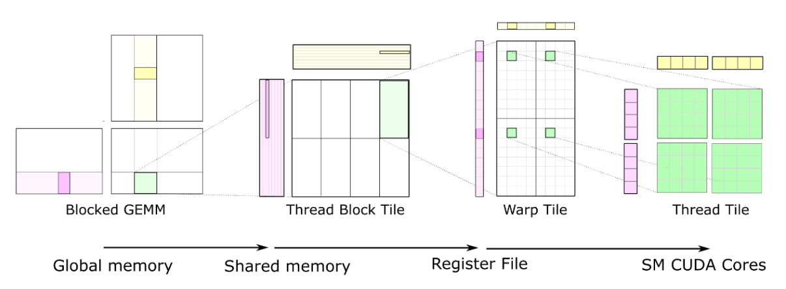
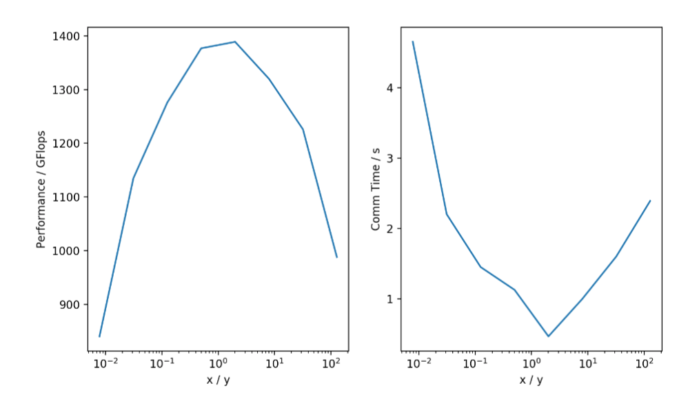

# ParallelComputing
UCSD FA22 CSE260 Course Programming Assignments

### PA1 - GEMM by Blas & SIMD

Implemented GeMM(General Matrix Multiplication) by blocking algorithm [Blas](https://github.com/flame/blis). Accelerated by SIMD on an ARM-64 architecture. Performance can be compared with blas method.

### PA2 - GEMM by GPU

Implemented GeMM by [CuBlas](https://github.com/NVIDIA/cutlass) blocking algorithm accelerated by GPU.

### PA3 - Aliev-Panfilov Model by MPI

Implemented simulation of Aliev-Panfilov model on a [super machine](access-ci.org). Communication done by MPI.

